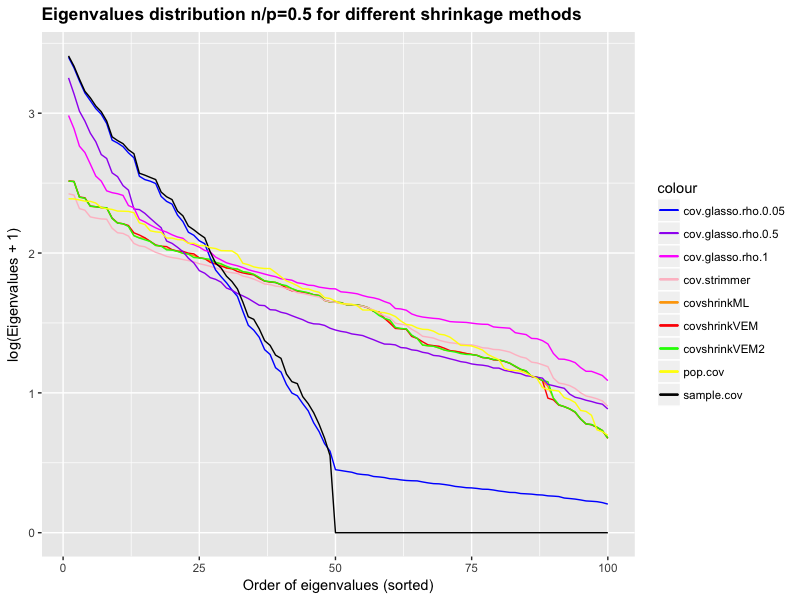

# CorShrink
R package for adaptive correlation and covariance matrix shrinkage.

[Kushal K Dey](http://kkdey.github.io/)

## Introduction

We use an adaptive framework to shrink correlation and covariance matrices. Instead
of directly applying shrinkage on the correlations, we first convert them to Fisher
Z-scores which are asymptotically normally distributed, and then adaptively shrink them
to 0 by assuming a mixture normal prior on the true population Fisher Z-scores. We present
three algorithms in this package to perform the shrinkage and compare the performance of 
these methods to the existing popular correlation and covariance shrinkage approaches due to 
Shafer and Strimmer and the GLASSO method due to Friedman, Hastie and Tibshirani. For the 
first two approaches, we fix the mixture normal component variances in the similar way
as in the Adaptive Shrinkage (ash) framework due to Matthew Stephens (2016).

## Model

- Model 1: The mixture normal component variances are fixed and the mixture proportions
  are estimated via maximum likelihood methods, using an EM algorithm. This approach is similar 
  to the ash method used by Stephens 2016 for false discovery rate calculation.
  
- Model 2: The mixture normal component variances are fixed and the mixture proportions are      assumed to have a Dirichlet distribution. The model parameters are estimated via Variational   EM methods. 

- Model 3: The mixture normal component variances are assumed to have relatively flat shaped     Inverse Gamma distribution. The starting points are determined using Model 2 to remove bias    due to local optima. The mixture proportions again have Dirichlet distribution. This model is   again fitted by Variational EM. 

## Installation and Loading 

This package will soon have an official release on CRAN. You can currently install the working version from Github.

```
library(devtools)
install_github("kkdey/CorShrink")
library(CorShrink)
```

## Demo Example

We now present a demo application of the methods in this package and the comparison with the Shafer-Strimmer (package **corpcor**) and the GLASSO (package **glasso**).

We first generate a population covariance matrix. We provide a function `generate_cov` to generate random positive definite covariance matrices of given size.

```
dim <- 100
nsamples <- 50
pop_cov <- CorShrink::generate_cov(dim);
```

Next, we draw a set of random samples from normal distribution with the above population covariance matrix generated.

```
generate_sample <- mvtnorm::rmvnorm(nsamples, rep(0, dim), pop_cov$Sigma);
cov_sample <- cov(generate_sample)
eigen_sample <- eigen(cov_sample, only.values = TRUE)
nsamples <- nsamples
```

If one wants to apply the three correlation shrinkages, one can just generate the sample correlation matrix `cormat` and specify the effective number of samples generated (taking care
of possible dependence among samples) `nsamples` and feed them into our model.

```
cor_sample <- cov2cor(cov_sample)
cor_shrunk_ML <- CorShrink::CorShrinkML(cor_sample, nsamples, image=TRUE)
cor_shrunk_VEM <- CorShrink::CorShrinkVEM(cor_sample, nsamples, image=TRUE)
cor_shrunk_VEM2 <- CorShrink::CorShrinkVEM2(cor_sample, nsamples, image=TRUE)
```

One can use the wrapper function, using the above three methods, to shrink the covariance matrix. We would have to feed the data to the `covShrink` function and specify the number of 
effective samples and the type of correlation shrinkage (out of the 3 above) that the user 
wants to implement. 

```
cov_sample_ML <-  CorShrink::CovShrink(generate_sample, nsamples, type="ML")
cov_sample_VEM <-  CorShrink::CovShrink(generate_sample, nsamples, type="VEM")
cov_sample_VEM2 <-  CorShrink::CovShrink(generate_sample, nsamples, type="VEM2")
```

We compare this to the covariance shrinkages due to **corpcor** and the **glasso** packages.

```
strimmer_sample <- corpcor::cov.shrink(generate_sample)
glasso_sample_005 <- glasso::glasso(cov_sample, rho = 0.05)
glasso_sample_05 <- glasso::glasso(cov_sample, rho = 0.5)
glasso_sample_1 <- glasso::glasso(cov_sample, rho = 1)
```

We next plot the eigenvalue distributions of all the shrinkage methods along with that of the
sample covariance matrix and the population covariance matrix and see how the eigenvalue 
distributions for different approaches relates to the population covariance matrix.

```
eigen_sample_ML <- eigen(cov_sample_ML, only.values = TRUE)
eigen_sample_VEM <- eigen(cov_sample_VEM, only.values = TRUE)
eigen_sample_VEM2 <- eigen(cov_sample_VEM2, only.values = TRUE)
eigen_strimmer <- eigen(strimmer_sample, only.values = TRUE)
eigen_glasso_005 <- eigen(glasso_sample_005$w, only.values = TRUE)
eigen_glasso_05 <- eigen(glasso_sample_05$w, only.values = TRUE)
eigen_glasso_1 <- eigen(glasso_sample_1$w, only.values = TRUE)
eigen_sample <- eigen(cov_sample, only.values = TRUE)


library(ggplot2)

eigendata <- data.frame(
  eigen_order = 1:dim,
  covshrink.ML = sort(log(as.numeric(eigen_sample_ML$values)+1),  decreasing=TRUE),
  covshrink.VEM = sort(log(as.numeric(eigen_sample_VEM$values)+1),  decreasing=TRUE),
  covshrink.VEM2 = sort(log(as.numeric(eigen_sample_VEM2$values)+1),
                 decreasing = TRUE),
  covshrink.strimmer = sort(log(as.numeric(eigen_strimmer$values)+1),  decreasing=TRUE),
  glasso.cov.005 = sort(log(as.numeric(eigen_glasso_005$values)+1),  decreasing=TRUE),
  glasso.cov.05 = sort(log(as.numeric(eigen_glasso_05$values)+1),  decreasing=TRUE),
  glasso.cov.1 = sort(log(as.numeric(eigen_glasso_1$values)+1),  decreasing=TRUE),
  sample_cov = sort(log(as.numeric(eigen_sample$values)+1),
                    decreasing=TRUE),
  pop_cov = sort(log(as.numeric(pop_cov$eigen)+1), decreasing=TRUE))

colnames(eigendata) <- c("eigenorder",
                         "covshrinkML",
                         "covshrinkVEM",
                         "covshrinkVEM2",
                         "cov.strimmer",
                         "cov.glasso.005",
                         "cov.glasso.05",
                         "cov.glasso.1",
                         "sample.cov",
                         "pop.cov")

library(ggplot2)
ggplot(eigendata, aes(eigenorder)) +
  geom_line(aes(y = covshrinkML, colour = "covshrinkML")) +
  geom_line(aes(y = covshrinkVEM, colour = "covshrinkVEM")) +
  geom_line(aes(y = covshrinkVEM2, colour = "covshrinkVEM2"))+
  geom_line(aes(y = cov.strimmer, colour = "cov.strimmer"))+
  geom_line(aes(y = cov.glasso.005, colour = "cov.glasso.rho.0.05"))+
  geom_line(aes(y = cov.glasso.05, colour = "cov.glasso.rho.0.5"))+
  geom_line(aes(y = cov.glasso.1, colour = "cov.glasso.rho.1"))+
  geom_line(aes(y = sample.cov, colour = "sample.cov"))+
  geom_line(aes(y = pop.cov, colour = "pop.cov"))+
  xlab("Order of eigenvalues (sorted)")+
  ylab("log(Eigenvalues + 1)")+
  scale_colour_manual(values=c("blue", "purple", "magenta", "pink", "orange", "red", "green", "yellow", "black", "grey"))+
  ggtitle(paste0("Eigenvalues distribution n/p=", round(nsamples/dim, 4)," for different shrinkage methods"))+
  theme(plot.title = element_text(lineheight=.8, face="bold"))
```




