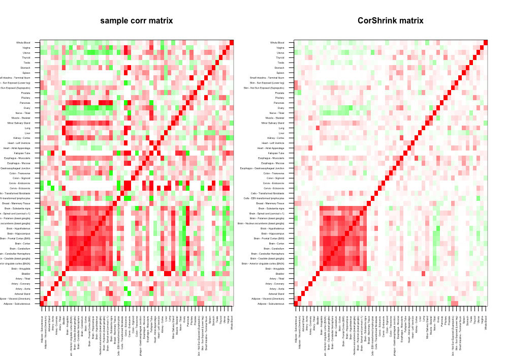
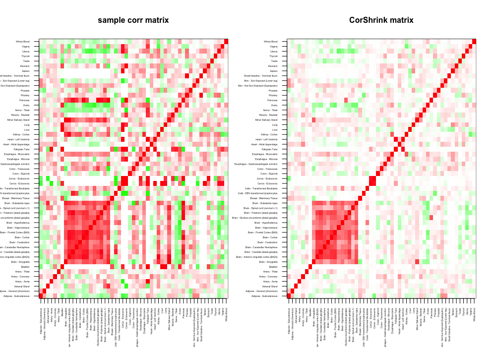

# CorShrink

R package for adaptive correlation and covariance matrix shrinkage.

[Kushal K Dey](http://kkdey.github.io/), [Matthew Stephens](http://stephenslab.uchicago.edu/).

A companion to the [ashr](https://github.com/stephens999/ashr) package by Matthew Stephens, that adaptive shrinks a vector or a matrix of correlations, where correlation between each pair is adaptively scaled based on the number of complete observations that generate the correlation. This allows the method to estimate the correlation matrix for a data matrix with large scale missing observations. 

## Installation

The instructions for installing and loading the package are as follows.

```
library(devtools)
install_github("kkdey/CorShrink")
```

Then load the package with:

```
library(CorShrink)
```

## Examples 

A demo example usage of **CorShrink** is given below. For detailed examples and methods, check [here](vignettes/corshrink.Rmd). 

```
data <- get(load(system.file("extdata", "sample_by_feature_data.rda",
                             package = "CorShrink")))
par(mfrow=c(1,2))
out <- CorShrinkData(data, sd_boot = FALSE, image_original = TRUE, 
                     image_corshrink = TRUE, optmethod = "mixEM",
                     image.control = list(x.cex = 0.3, y.cex = 0.3))                             
                             
```



The above approach uses an asymototic version of CorShrink. Alternatively, one can use a re-sampling based approach.

```
par(mfrow=c(1,2))
out <- CorShrinkData(data, sd_boot = TRUE, image_original = TRUE, 
                     image_corshrink = TRUE, optmethod = "mixEM",
                     image.control = list(x.cex = 0.3, y.cex = 0.3))
```



## Acknowledgements

The authors would like to thank the GTEx Consortium, John Blischak, Sarah Urbut, Chiaowen Joyce Hsiao, Peter Carbonetto and all members of the Stephens Lab. 

## Support

For any queries related to the **CorShrink** package, contact Kushal K. Dey here [kkdey@uchicago.edu](kkdey@uchicago.edu)


