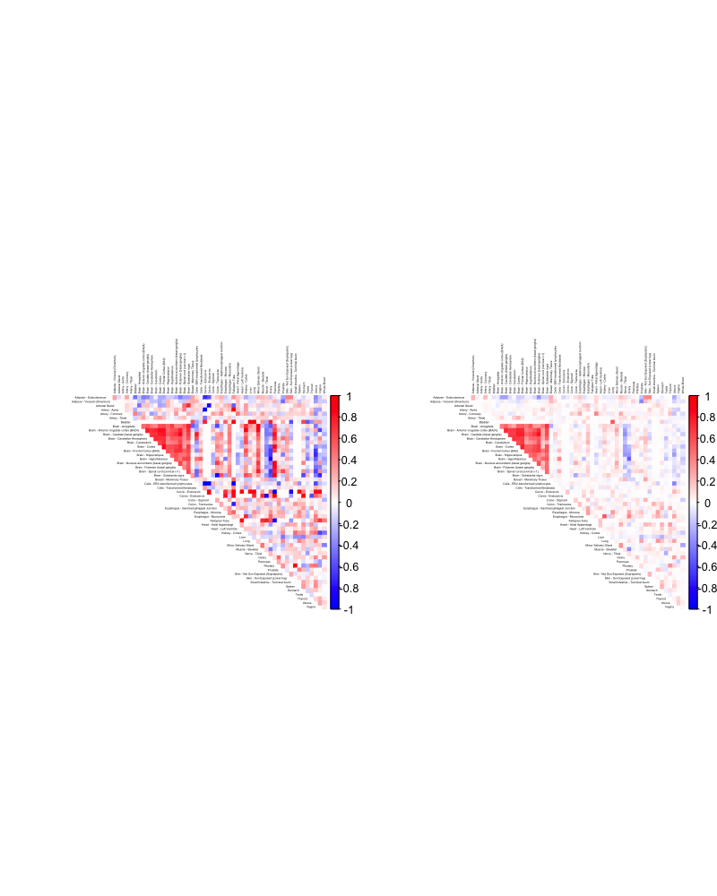
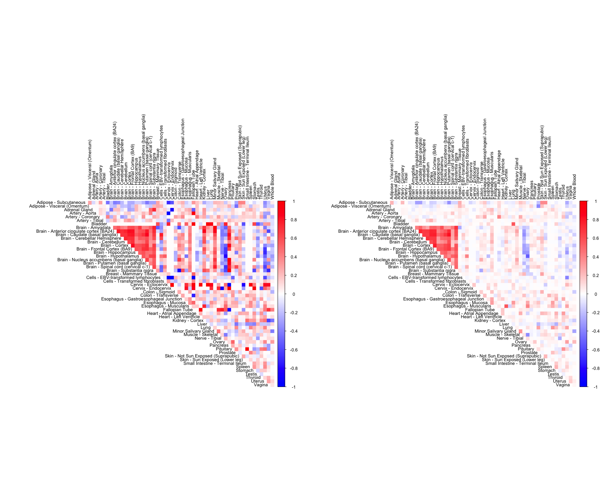

# CorShrink

[](https://cranlogs.r-pkg.org/badges/grand-total/CorShrink)
[](https://cranlogs.r-pkg.org/badges/CorShrink)
[](https://cranlogs.r-pkg.org/badges/last-day/CorShrink)


R package for adaptive correlation and covariance matrix shrinkage.

[Kushal K Dey](http://kkdey.github.io/), [Matthew Stephens](http://stephenslab.uchicago.edu/).

## License

Copyright (c) 2017-2018, Kushal Dey.

All source code and software in this repository are made available
under the terms of the [GNU General Public
License](http://www.gnu.org/licenses/gpl.html). See the
[LICENSE](LICENSE) file for the full text of the license.

## Citing this work

If you find that this R package is useful for your work, please cite
the following paper: 

>Stephens, M. 2016. False Discovery Rates: A New Deal. doi: http://dx.doi.org/10.1101/038216


## Methods Overview

A companion package to the [ashr](https://github.com/stephens999/ashr) package by Matthew Stephens [see paper](https://www.ncbi.nlm.nih.gov/pmc/articles/PMC5379932/), **CorShrink** adaptive shrinks correlation between a pair of variables based on the number of pairwise complete observations. **CorShrink** can be applied to a vector or matrix of pairwise correlations and can also be generalized to quantities similar in nature to correlations - like partial correlations, rank correlations and cosine simialrities from word2vec model. **CorShrink** when applied to a data matrix, is able to learn an individual shrinkage intensity for a pair of variables from the number of missing observations between each such pair - which allows the method to handle large scale missing observations (a demo of which is presented in the example below). 


## Quick Start

The instructions for installing the package are as follows.

*For CRAN version*:

```
install.packages("CorShrink")
```

*For the development version*: 

```
library(devtools)
install_github("kkdey/CorShrink", build_vignettes = TRUE)
```

Then load the package with:

```
library(CorShrink)
```

A demo example usage of **CorShrink** is given below. For detailed examples and methods, check [here](vignettes/corshrink.Rmd). 

We first load an example data matrix of gene expression for a specific gene in a tissue sample drawn from a test individual in the [GTEx Project](https://www.gtexportal.org/home/). We note that there are many missing observations in this data matrix, which correspond to tissue samples not contributed by an individual.

```
data("sample_by_feature_data")
sample_by_feature_data[1:5, 1:5]

           Adipose - Subcutaneous Adipose - Visceral (Omentum)
GTEX-111CU              10.472332                     10.84006
GTEX-111FC               7.335392                           NA
GTEX-111VG               9.118889                           NA
GTEX-111YS              10.806459                     11.26113
GTEX-1122O              11.040446                     11.71497
           Adrenal Gland Artery - Aorta Artery - Coronary
GTEX-111CU      2.721234             NA                NA
GTEX-111FC            NA             NA                NA
GTEX-111VG            NA             NA                NA
GTEX-111YS      3.454823       1.162059                NA
GTEX-1122O      1.522667       1.674467          4.188002
```

We use **CorShrink** to estimate the correlation matrix taking account of the missing observations and compare the result with the matrix of pairwise correlations generated from complete observations for each pair of features. 

```
out <- CorShrinkData(sample_by_feature_data, sd_boot = FALSE, image = "both",
                    image.control = list(tl.cex = 0.2))                            
```



The above approach uses an asymototic version of CorShrink. Alternatively, one can use a re-sampling or Bootstrapping approach.

```
out <- CorShrinkData(sample_by_feature_data, sd_boot = TRUE, image = "both",
                    image.control = list(tl.cex = 0.2))
```



Walk through some more detailed examples in the
[vignette](vignettes/corshrink.Rmd):

```R
vignette("corshrink")
```

## Credits

The authors would like to thank the GTEx Consortium, John Blischak, Sarah Urbut, Chiaowen Joyce Hsiao, Peter Carbonetto and all members of the Stephens Lab. 
For any queries related to the **CorShrink** package, contact Kushal K. Dey here [kkdey@uchicago.edu](kkdey@uchicago.edu)


